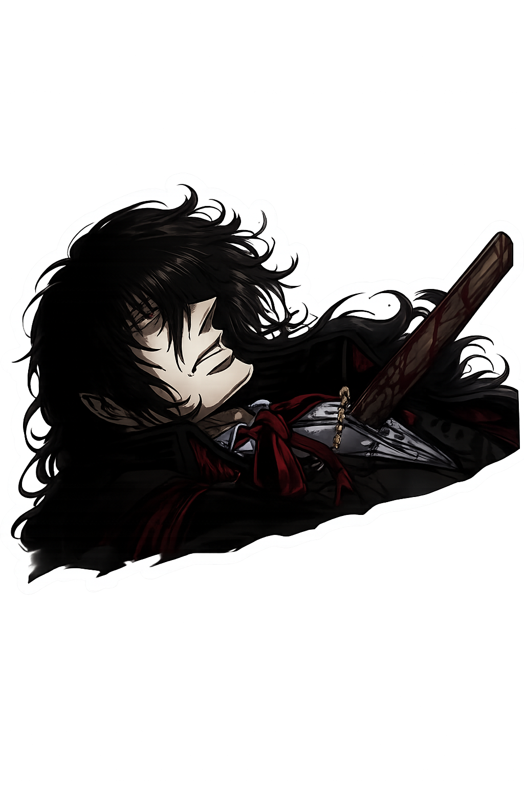

  

  

<table align="center" cellspacing="15">
  <tr>
✠
    <td align="center">
      <a href="https://x.com/R1dsan820m0">
         
        Baobei
      </a>
    </td>

   
  
  ✠  <td align="center">
      <a href="https://github.com/tembluudud">
         
        My king
      </a>
    </td>

  ✠  <td align="center">
      <a href="https://github.com/VersaillesBrainrot">
         
        twin
      </a>
    </td>

  </tr>
</table>
    

